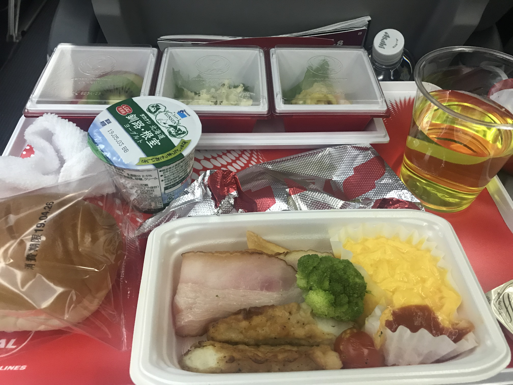

# ①ベトナム旅行 
## はじめに
2019.4/24〜29のGW期間にベトナム旅行へ。夫婦にとって初めてのベトナムです。主人の友人夫婦がベトナムに短期間移住していると聞き、彼らに会いに行ってきました。また入籍してから１年経ち、結婚式も終わりひと段落したということで、「結婚記念日ハネムーン」となりました。５日間のうち訪問した都市は、ホーチミン、ダナン、ホイアン。おすすめの観光地、ベトナムフードなどを私のInstagramを引用しつつ、紹介していきます。  
### ホーチミン１日目
- JALでホーチミンへ
- 朝食@ PHO HOI
- ランドマーク８１
- Cong Cafe
- 昼食@ニャハンゴン
- タンディン教会
- サイゴンセンターショッピングモール
- 夕食@ピザ４P's
- ウオーキングストリート 
### JALでホーチミンへ 
初めてのJAL国際線にワクワクする私（アジア圏内だといつもLCCを利用していました）。機内食が美味しくて初めて完食しました。    

今まで残してごめんなさい。日本のクオリティに感動です。
機内では、たくさん気になっていた映画がたくさんあったためとても迷いました。感動系よりも気分をハッピーにしてくれる映画を観たかったため、「メリーポピンズ リターンズ」を。    
メリーポピンズ.jpg      
幼い頃、メリーポピンズが好きでよくビデオを観ていたなぁ、と懐かしく感じました。夢の世界に浸りながら、無事到着。到着時間は早朝5時。ピンク色のベトナムの朝日が、心地よく私たちを迎えてくれました。   
IMG_1184.jpg   
IMG_1185.jpg   
早朝５時だというにも関わらず、主人の友人ケニーは迎えにきてくれるということで、再会のハグ。優しいケニーには本当に感謝です！荷物を置くために、ケニーの家までタクシーで。ベトナム人は、とても早起きらしく朝6時過ぎだったのですが、このバイクの多さに驚きました。アジアならではの光景かもしれません。バイクが安く、小回りも利くため、車より圧倒的にバイクの数の方が多いです。   
IMG_0816.jpg   
IMG_1187.JPg   
### 朝食@ PHO HOI
ケニーの家の近所のPHO HOIで２度目の朝食。牛肉のフォー(フォーボー)とマンゴースムージーを頂きました。こちらのお店では、牛肉の部位を自分で選ぶことができます。たしかおススメを選んだ気がします。      
LRG_DSC03452.JPG    
LRG_DSC03455.JPG     
母はアジアン料理が好きなため、昔からよく作ってくれたフォー。食べると、なぜか懐かしい味、安心する味、そしてめっちゃ美味しいいい！！さっぱりしていて、麺は米粉で馴染み深く、朝からぺろっと食べることができました。こちらのマンゴースムージー、ベトナムの飲み物の中で一番美味しかったです。キンキンに冷えたお店の中で、冷たいマンゴースムージーを飲むととても寒くなりました。南国あるあるなのかもしれません。(特に女性が出かける際は、薄着の上着を持つことをおすすめします)    

### [ランドマーク81](http://vincom.com.vn/)   
住所：772 Điện Biên Phủ, Vinhomes Tân Cảng, Bình Thạnh, Hồ Chí Minh, ベトナム  
[地図]https://goo.gl/maps/5iRsJaqaLqZ5gQuF6
IMG_1199.jpg     
ちなみに後ろにある高層マンションにお邪魔しました。なんとも都会、、、 
ランドマーク８１内にあった一人カラオケ。ここで一人で歌うの恥ずかしくないのかな？個人的には、日本のカラオケの大部屋で一人で歌うのが好きです。   
IMG_1213.jpg    
こちらは、SNSの投稿をプリントしてくれる機械。私は、インスタの投稿から写真を選びました。結婚式の写真を印刷でき、大満足です。最近は、SNSからできるアクティビティが多いように感じます。   
IMG_1214.JPG    

### Cong Cafe  
住所：Vinhomes Central Park, ビンタイン区 ホー・チ・ミン ベトナム[Googleマップ](https://goo.gl/maps/vWFhbRxPCXyULjHm9)   
Cong Cafeは、チェーン店なので、訪問したホーチミン・ダナンでもお世話になりました。ベトナムコーヒーが有名だけあって、たくさんカフェがあります。   
[トリップアドバイザー](https://www.tripadvisor.jp/Restaurant_Review-g293925-d10167203-Reviews-Cong_Cafe-Ho_Chi_Minh_City.html)でも高得点のハノイ発のカフェです。こちらのお店のココナッツコーヒーが美味しいと聞きお茶することになったのですが、私はココナッツコーヒーを、主人とケニーはなぜか八朔のスムージーを飲んでいました。(そちらもスッキリとしていて暑いときにちょうどいい飲み物でした。)レジに並んでいると、日本人女性３人組がいて、フレンドリーな主人は「こちらにお住まいなんですか？」と話しかけていました。お話しを伺うと、こちらのお三方は、ご主人が同じ職場の駐在妻のようです。お話しを伺うにつれて、まだベトナムに来て5時間程度ですが、すでに私たち夫婦はここに住みたくなりました。   
店内はアジア感漂っていて、店員さんたちは、アーミー服を着ていてユニークでした。   
IMG_1192のコピー.jpg   
IMG_1194のコピー.jpg     
IMG_1197のコピー.jpg       
IMG_0981のコピー.jpg          

### 昼食@[ニャハンゴン](http://quananngon.com.vn/)   
住所：160 Pasteur, Bến Nghé, Quận 1, Hồ Chí Minh, ベトナム    
昼食は、ベトナム人の奥様オススメのベトナム料理屋さんです。現地の方と観光客が半々。とても賑やかで、たくさんのベトナム料理を味わうことができます。揚げ春巻き、バインセオ、タニシ等を食べました。ベトナム人の奥様は、タニシが好きだそうですが、ケニーと主人と私は苦手なようで…。国によって食べ慣れた物があり、文化の違いがわかり面白いです。特にベトナムでの食べ物では、生の食べ物は、あまり食べない方がいいということだったので、加熱したものを食べるようにしていました。ケニーはアメリカ人で、移住した当初はなんども食中毒にあったみたいです。主人と私は、お腹が弱いのでとにかく注意して食べました！    
IMG_1241.jpg     
IMG_1239のコピー.jpg         
IMG_1238のコピー.jpg         
IMG_1235のコピー.jpg        

### タンディン教会 
タンディン教会は、インスタ映えなピンクの教会です。   
住所：174 Hai Bà Trưng, Phường 8, Quận 1, Hồ Chí Minh, ベトナム    
インスタで、#タンディン教会と検索するとたくさんでてきます。観光客はほとんど韓国人でした。写真を撮ろうとすると教会自体が大きく収まりきれませんでした。ベトナム人のケニーの奥さんに「ここはインスタで流行ってるけど来たことあった？」と聞くと、「初めて来たよ。ベトナム人はキリシタンの人は少ないから来る人はほぼ観光客なのよ」と教えてくれました。日本では宗教が違うからという理由で来ないってことなさそうだな…とまた文化の違いを感じていました。インスタ映えのためなら人が多く集まってそうなイメージです。(インスタで検索して行きたい！と思ったのは、この私です。)
[#タンディン教会](https://www.instagram.com/p/BymIDCYH_7v/?igshid=fj3czszzxr2y)

### [サイゴンセンターショッピングモール](http://shopping.saigoncentre.com.vn/)         
住所：65 Lê Lợi, Bến Nghé, Quận 1, Hồ Chí Minh 70000 ベトナム    
高島屋でもあるので、日本のデパートのように清潔で綺麗です。最上階は、日本食のレストラン街となっていました。入り口には、なんとも派手な催し物。アジア感がただよっています。現金を持っていなかったため、モール内のATMへ。１００，０００ドンは、日本円で約５０００円。下２桁を消してから２で割ると計算しやすいです。とにかく物価が安いため、最初のうちは０が多くあると混乱してしまいました。主人のようにパパッと早く頭の中で計算できないのよ…。ベトナム滞在中は、頭の回転が少し早くなった気がしました。   
IMG_1284のコピー.jpg          
IMG_1298のコピー.jpg             

### 夕食@ [ピザ４P's](https://pizza4ps.com/)
住所：8 Thủ Khoa Huân, Phường Bến Thành, Quận 1, Hồ Chí Minh, ベトナム    
ベトナム内に７店舗あり、かなり人気のイタリアンレストラン。若者や、ファミリー層に特に人気だそうです。ピザ４P'sは日本人が経営しており、翌日にケニーの紹介で経営者に会うことになります。 夜になると行列になるため、事前に予約してくれていました。ロゼで乾杯し、グリーンサラダを食べてピザとパスタを頂きました。とても美味しかったです。ピザもパスタも両方1000円以外なのでとてもコスパよく感じました。日本で食べるイタリアンと変わりありませんでした。   
IMG_1316のコピー.jpg        
IMG_1317のコピー.jpg        

### ウォーキングストリート   
住所：2-28 Bùi Viện, Phường Phạm Ngũ Lão, Quận 1, Hồ Chí Minh, ベトナム   
スポーツバーがたくさん並んでおり、大音量の音楽が流れています。大音量のため、少し耳がおかしくなりそうでした。奥の方に進むと、かなり人で賑やかでした。みんな楽しそうにお酒を飲んでいました。  
IMG_1330のコピー.jpg     å
IMG_1329.jpg    